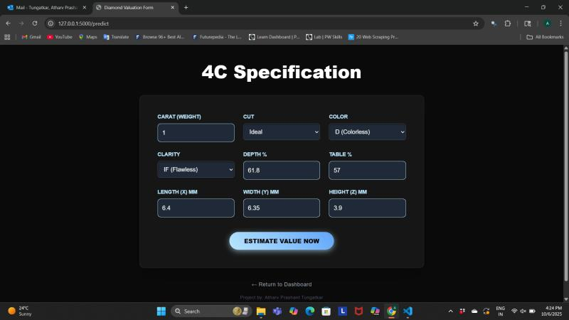
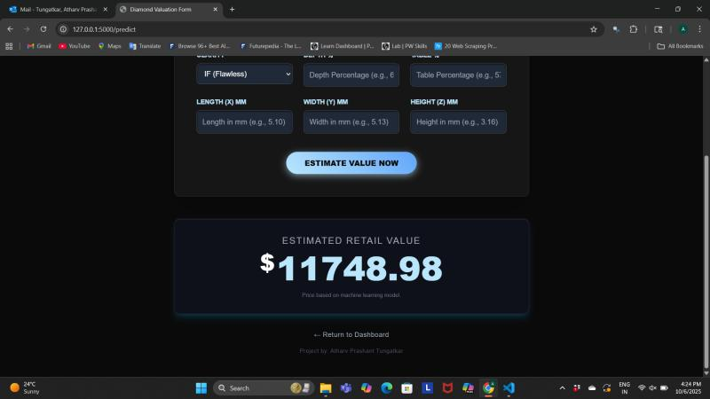

# 💎 Diamond Price Prediction

<div align="center">


**An end-to-end machine learning solution for predicting diamond prices with 93.62% accuracy**

*Born from curiosity about gem pricing inconsistencies, transformed into a data-driven solution*

[Problem Statement](#problem-statement) • [Demo](#demo) • [Features](#features) • [Installation](#installation)

</div>

---

## 📋 Table of Contents

- [Problem Statement](#problem-statement)
- [Overview](#overview)
- [Demo](#demo)
- [Features](#features)
- [Dataset](#dataset)
- [Technology Stack](#technology-stack)
- [Project Architecture](#project-architecture)
- [Installation](#installation)
- [Usage](#usage)
- [Model Performance](#model-performance)
- [Project Structure](#project-structure)
- [API Endpoints](#api-endpoints)
- [Future Enhancements](#future-enhancements)
- [Contributing](#contributing)
- [License](#license)
- [Contact](#contact)

---

## 💡 Problem Statement

Have you ever wondered why two nearly identical diamonds can have vastly different price tags? During my visits to gem dealers, I noticed something puzzling: similar-looking diamonds were quoted at dramatically different prices, and the reasoning behind these variations was never clear.

**The Challenge:**
- Gem dealers often provide inconsistent pricing for similar diamonds
- The factors driving diamond prices aren't transparent to consumers
- It's difficult to know if you're getting a fair deal without expertise
- The 4C characteristics (Carat, Cut, Color, Clarity) influence price in complex, non-linear ways

**My Curiosity Led to This Project:**
I decided to take a data-driven approach to understand what really determines diamond prices. This started as a fun exploration project to demystify diamond pricing and evolved into a comprehensive machine learning solution that can predict prices with over 93% accuracy. Now anyone can input a diamond's characteristics and get an instant, data-backed price estimate!

---

## 🎯 Overview

The Diamond Price Prediction project is a comprehensive machine learning application that predicts diamond prices based on the 4C characteristics (Carat, Cut, Color, Clarity) along with physical dimensions. Built with production-grade code practices, this project demonstrates end-to-end ML pipeline development from data ingestion to model deployment.

**Key Highlights:**
- 📊 Analyzed 190,000+ diamond records with 10 features
- 🎯 Achieved 93.62% accuracy using Linear Regression
- 🏗️ Modular, scalable architecture using OOP principles
- 🚀 Flask-based REST API for real-time predictions
- 📝 Comprehensive logging and error handling
- 🔄 Automated ML pipeline with preprocessing and model training

---

## 🎬 Demo

### Application Interface

*Landing page with project overview*

### 4C Specification Input

*Interactive form for entering diamond characteristics*

### Price Prediction Result

*Real-time price estimation based on input parameters*

---

## ✨ Features

### Data Processing & Analysis
- ✅ Exploratory Data Analysis (EDA) with visualization
- ✅ Feature engineering based on correlation analysis
- ✅ Outlier detection and handling
- ✅ Automated data validation pipeline

### Machine Learning
- ✅ Multiple regression models comparison (Linear, Lasso, Ridge, Elastic Net)
- ✅ Cross-validation for robust model evaluation
- ✅ Hyperparameter tuning
- ✅ Model serialization for deployment (pickle format)

### Software Engineering
- ✅ Object-Oriented Programming design patterns
- ✅ Modular code structure with separation of concerns
- ✅ Custom exception handling
- ✅ Comprehensive logging system
- ✅ Configuration-driven approach

### Deployment
- ✅ Flask web application
- ✅ RESTful API endpoints
- ✅ Interactive HTML frontend
- ✅ Real-time prediction capability
- ✅ Local hosting ready

---

## 📊 Dataset

**Source:** Diamond dataset with 190,000+ records

**Features:**
- `carat`: Weight of the diamond (0.2–5.01)
- `cut`: Quality of the cut (Fair, Good, Very Good, Premium, Ideal)
- `color`: Diamond color grade (D–J, D being best)
- `clarity`: Clarity grade (I1, SI2, SI1, VS2, VS1, VVS2, VVS1, IF)
- `depth`: Total depth percentage (43–79)
- `table`: Width of top relative to widest point (43–95)
- `x`: Length in mm (0–10.74)
- `y`: Width in mm (0–58.9)
- `z`: Depth in mm (0–31.8)

**Target Variable:**
- `price`: Diamond price in USD

**Key Insights from EDA:**
- Strong positive correlation between carat and price (r = 0.92)
- Premium and Ideal cuts command higher prices
- Color grades D–F show significant price premiums
- Clarity impacts price, especially for VVS and IF grades

---

## 🛠️ Technology Stack

### Core Technologies
- **Python 3.8+** - Primary programming language
- **NumPy** - Numerical computations
- **Pandas** - Data manipulation and analysis
- **Scikit-learn** - Machine learning algorithms
- **Flask** - Web framework for API deployment

### Data Visualization
- **Matplotlib** - Statistical plotting
- **Seaborn** - Advanced visualization

### Model Deployment
- **Pickle** - Model serialization
- **HTML/CSS** - Frontend interface
- **Jinja2** - Template rendering

---

## 🏗️ Project Architecture

```
┌─────────────────┐
│  Data Ingestion │
└────────┬────────┘
         │
┌────────▼────────┐
│ Data Validation │
└────────┬────────┘
         │
┌────────▼────────────┐
│ Data Transformation │
└────────┬────────────┘
         │
┌────────▼──────────┐
│  Model Training   │
└────────┬──────────┘
         │
┌────────▼─────────┐
│ Model Evaluation │
└────────┬─────────┘
         │
┌────────▼──────────┐
│  Flask API Server │
└───────────────────┘
```

**Design Patterns:**
- **Pipeline Pattern**: Sequential data processing stages
- **Factory Pattern**: Model creation and selection
- **Singleton Pattern**: Logger and configuration management
- **Strategy Pattern**: Interchangeable ML algorithms

---

## 🚀 Installation & Setup

### Prerequisites
- Python 3.8 or higher
- pip package manager
- Virtual environment (recommended)

### For Users (Try the Application)

If you just want to **use and test** the application locally:

#### Step 1: Clone the Repository
```bash
git clone https://github.com/AtharvTungatkar/DiamondPricePrediction.git
cd DiamondPricePrediction
```

#### Step 2: Create Virtual Environment
```bash
# Windows
python -m venv venv
venv\Scripts\activate

# Linux/Mac
python3 -m venv venv
source venv/bin/activate
```

#### Step 3: Install Dependencies
```bash
pip install -r requirements.txt
```

#### Step 4: Run the Application
```bash
python app.py
```

The application will start on `http://127.0.0.1:5000`

---

### For Contributors (Modify and Improve)

If you want to **contribute** to this project:

#### Step 1: Fork the Repository
1. Click the **"Fork"** button at the top-right of this repository
2. This creates your own copy under your GitHub account

#### Step 2: Clone Your Fork
```bash
git clone https://github.com/YOUR-USERNAME/DiamondPricePrediction.git
cd DiamondPricePrediction
```

#### Step 3: Set Up Development Environment
```bash
# Create virtual environment
python -m venv venv
source venv/bin/activate  # or venv\Scripts\activate on Windows

# Install dependencies
pip install -r requirements.txt

# Create a new branch for your feature
git checkout -b feature/your-feature-name
```

#### Step 4: Make Changes and Submit
```bash
# After making changes
git add .
git commit -m "Description of your changes"
git push origin feature/your-feature-name
```

Then open a Pull Request on GitHub!

**Note:** Please read [CONTRIBUTING.md](CONTRIBUTING.md) for detailed guidelines before contributing.

---

## 💻 Usage

### Web Interface

1. **Access the Application**: Open your browser and navigate to `http://127.0.0.1:5000`

2. **Enter Diamond Specifications**:
   - Carat weight (e.g., 1.0)
   - Cut quality (Fair, Good, Very Good, Premium, Ideal)
   - Color grade (D through J)
   - Clarity grade (IF, VVS1, VVS2, VS1, VS2, SI1, SI2, I1)
   - Depth percentage (e.g., 61.8)
   - Table percentage (e.g., 57)
   - Dimensions: Length (x), Width (y), Height (z) in mm

3. **Get Prediction**: Click "Estimate Value Now" to receive the predicted price

### API Endpoint

**POST /predict**

Request body:
```json
{
  "carat": 1.0,
  "cut": "Ideal",
  "color": "D",
  "clarity": "IF",
  "depth": 61.8,
  "table": 57,
  "x": 6.4,
  "y": 6.35,
  "z": 3.9
}
```

Response:
```json
{
  "predicted_price": 11748.98,
  "status": "success"
}
```

### Command Line Training

To retrain the model with new data:

```bash
python src/pipelines/training_pipeline.py
```

To run predictions programmatically:

```bash
python src/pipelines/prediction_pipeline.py
```

---

## 📈 Model Performance

### Model Comparison

| Model | R² Score | RMSE | MAE | Training Time |
|-------|----------|------|-----|---------------|
| **Linear Regression** | **0.9362** | **1012.45** | **673.21** | **0.8s** |
| Ridge Regression | 0.9361 | 1013.89 | 674.85 | 1.2s |
| Lasso Regression | 0.9355 | 1018.32 | 678.14 | 2.1s |
| Elastic Net | 0.9358 | 1015.67 | 676.42 | 1.8s |

**Winner: Linear Regression** 
- Best overall performance with 93.62% accuracy
- Lowest computational overhead
- Fastest training and prediction time

### Cross-Validation Results
- **5-Fold CV Score**: 0.9348 ± 0.0023
- **Consistent performance** across all folds
- No signs of overfitting

### Feature Importance
1. **Carat** (0.87) - Most significant predictor
2. **Clarity** (0.08) - Secondary importance
3. **Color** (0.03) - Tertiary factor
4. **Cut** (0.02) - Marginal impact

---

## 📁 Project Structure

```
DiamondPricePrediction/
│
├── application.py              # Flask application entry point
├── app.py                      # Alternative app runner
├── requirements.txt            # Python dependencies
├── setup.py                    # Package installation script
├── README.md                   # Project documentation
│
├── artifacts/                  # Generated files
│   ├── model.pkl              # Trained model
│   ├── preprocessor.pkl       # Data preprocessing pipeline
│   └── raw_data/              # Raw dataset storage
│
├── logs/                       # Application logs
│   └── application.log        # Runtime logs
│
├── notebooks/                  # Jupyter notebooks
│   ├── EDA.ipynb              # Exploratory Data Analysis
│   └── Model_Training.ipynb   # Model experimentation
│
├── src/                        # Source code
│   ├── __init__.py
│   │
│   ├── components/            # Core ML components
│   │   ├── __init__.py
│   │   ├── data_ingestion.py
│   │   ├── data_transformation.py
│   │   └── model_trainer.py
│   │
│   ├── pipelines/             # End-to-end pipelines
│   │   ├── __init__.py
│   │   ├── training_pipeline.py
│   │   └── prediction_pipeline.py
│   │
│   ├── logger.py              # Custom logging utility
│   ├── exception.py           # Custom exception handler
│   └── utils.py               # Helper functions
│
└── templates/                  # HTML templates
    └── index.html             # Web interface
```

### Key Modules

**Data Ingestion** (`data_ingestion.py`)
- Reads raw data from source
- Performs train-test split
- Saves split data for pipeline

**Data Transformation** (`data_transformation.py`)
- Handles missing values
- Encodes categorical features
- Scales numerical features
- Creates preprocessing pipeline

**Model Trainer** (`model_trainer.py`)
- Trains multiple regression models
- Performs hyperparameter tuning
- Evaluates model performance
- Saves best performing model

**Training Pipeline** (`training_pipeline.py`)
- Orchestrates complete training workflow
- Manages component dependencies
- Handles errors and logging

**Prediction Pipeline** (`prediction_pipeline.py`)
- Loads trained model and preprocessor
- Transforms new input data
- Generates predictions
- Returns formatted results

---

## 🌐 API Endpoints

### 1. Home Page
```
GET /
```
Returns the main HTML interface

### 2. Predict Diamond Price
```
POST /predict
Content-Type: application/x-www-form-urlencoded
```

**Parameters:**
- `carat` (float): Diamond weight
- `cut` (string): Cut quality
- `color` (string): Color grade
- `clarity` (string): Clarity grade
- `depth` (float): Depth percentage
- `table` (float): Table percentage
- `x` (float): Length in mm
- `y` (float): Width in mm
- `z` (float): Depth in mm

**Response:**
Returns HTML page with predicted price

---

## 🔮 Future Enhancements

### Short-term Goals
- [ ] Add more regression models (XGBoost, Random Forest)
- [ ] Implement feature selection techniques
- [ ] Add data visualization dashboard
- [ ] Create Docker container for easy deployment
- [ ] Add unit tests and integration tests

### Long-term Vision
- [ ] Deploy on cloud platforms (AWS/Azure/GCP)
- [ ] Implement CI/CD pipeline
- [ ] Add authentication and user management
- [ ] Create mobile application
- [ ] Integrate with diamond retailer APIs
- [ ] Add price trend analysis and forecasting
- [ ] Implement A/B testing for model versions
- [ ] Add explainable AI features (SHAP values)

---

## 🤝 Contributing

Contributions are welcome! Please follow these steps:

1. Fork the repository
2. Create a feature branch (`git checkout -b feature/AmazingFeature`)
3. Commit your changes (`git commit -m 'Add some AmazingFeature'`)
4. Push to the branch (`git push origin feature/AmazingFeature`)
5. Open a Pull Request

**Coding Standards:**
- Follow PEP 8 style guide
- Add docstrings to all functions
- Write unit tests for new features
- Update documentation accordingly

---

## 📄 License

This project is licensed under the MIT License - see the [LICENSE](LICENSE) file for details.

---

## 👤 Contact

**Atharv Tungatkar**

- GitHub: [@AtharvTungatkar](https://github.com/AtharvTungatkar)
- LinkedIn: [Connect with me](https://www.linkedin.com/in/atharv-tungatkar)
- Email: atharvprashant.tungatkar@gmail.com

---

## 🙏 Acknowledgments

- Diamond dataset source: [Kaggle/Other source]
- Inspiration from various ML deployment tutorials
- Thanks to the open-source community for amazing tools

---

## 📊 Project Statistics


---

<div align="center">

**⭐ Star this repository if you find it helpful!**

Made with ❤️ by Atharv Tungatkar

</div>